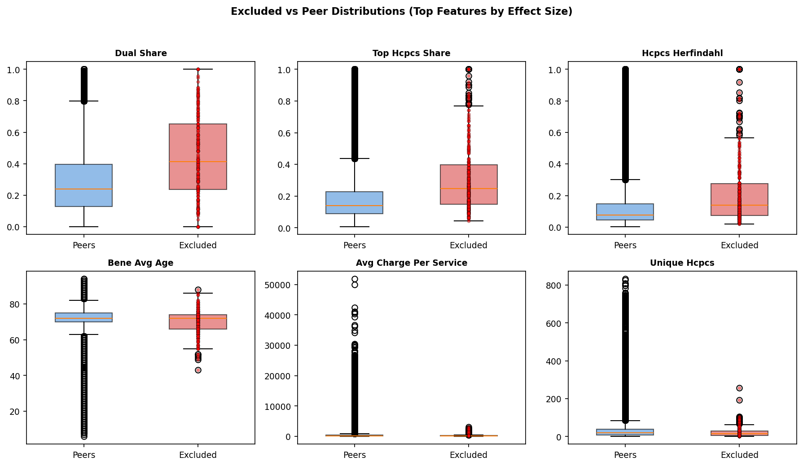
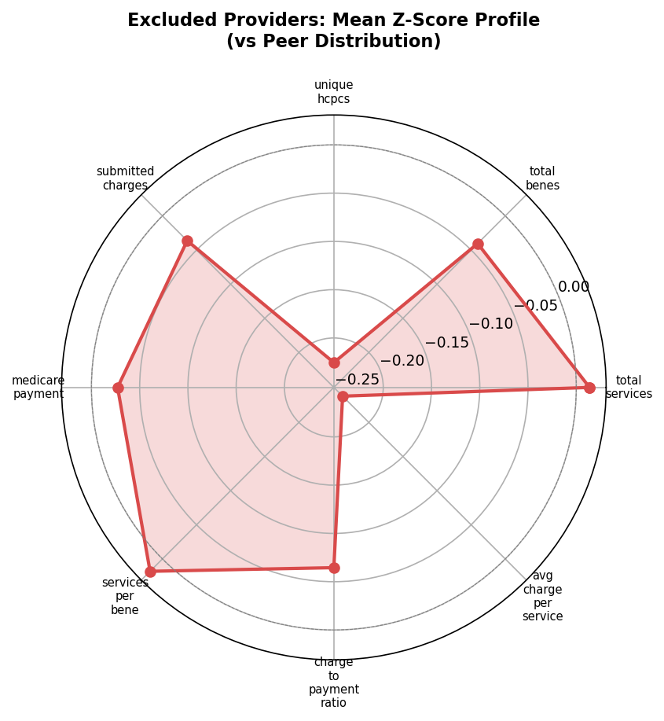
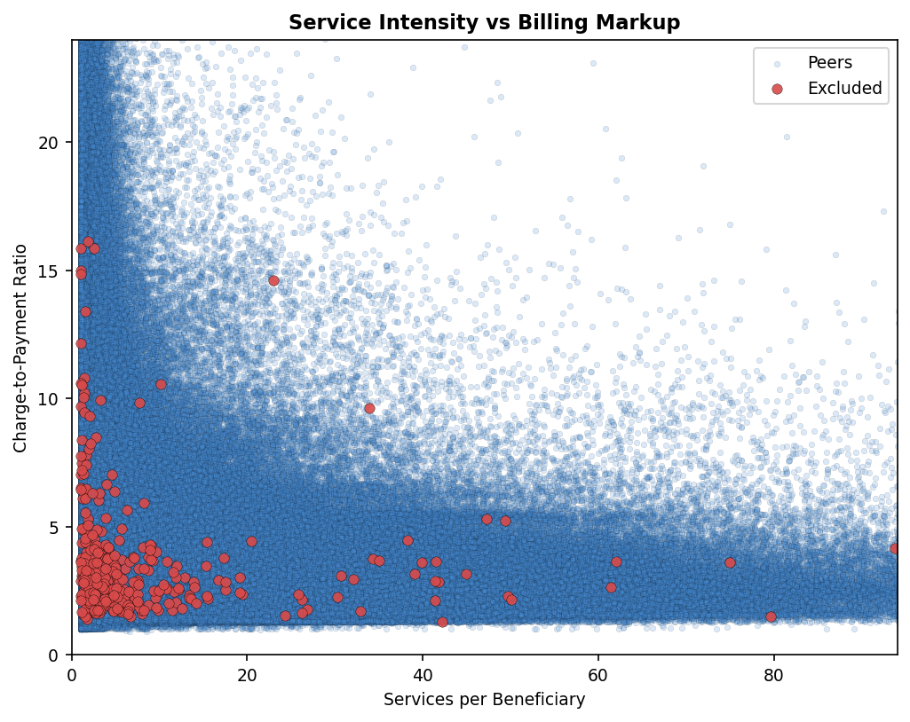
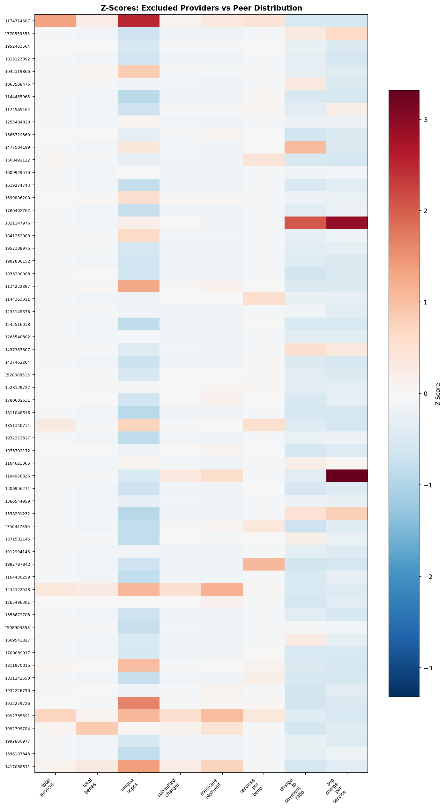
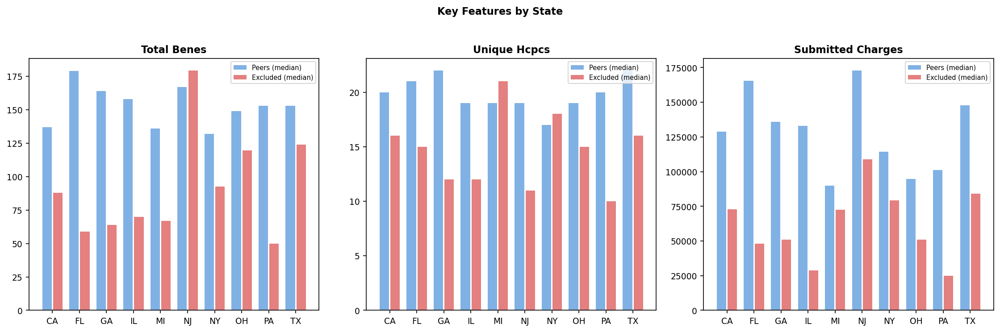

# Medicare Fraud Backtest POC — Results

**Generated:** 2026-05-15 03:46

## Cohort Summary

- **Excluded providers matched to Part B billing:** 346
- **Peer providers (same state/specialty/year):** 2,862,751
- **States:** FL, TX, CA, NY, NJ, IL, PA, OH, MI, GA
- **Exclusion date range:** 2020-2023
- **Billing data:** best available pre-exclusion year per provider

### By State

| State | Excluded | Peers |
|-------|----------|-------|
| CA | 63 | 464,419 |
| FL | 67 | 365,212 |
| GA | 14 | 131,233 |
| IL | 17 | 235,078 |
| MI | 29 | 211,361 |
| NJ | 10 | 145,419 |
| NY | 42 | 408,000 |
| OH | 30 | 236,628 |
| PA | 23 | 292,012 |
| TX | 51 | 373,389 |

### Excluded Providers

Click to expand (all providers)

| NPI | Name | State | Specialty | Excl Type | Excl Date | Billing Year |
|-----|------|-------|-----------|-----------|-----------|-------------|
| 1871502146 | BALBOA AMBULANCE INC. | CA | AMBULANCE COMPANY | 1128b7 | 2021-12-07 | 2020 |
| 1285651638 | BESTCARE LABORATORY SERVICES, LLC | TX | LABORATORY | 1128b7 | 2021-01-26 | 2018 |
| 1598834459 | OKEFENOKEE EMS INC. | GA | AMBULANCE COMPANY | BRCH SA | 2022-05-25 | 2021 |
| 1942344262 | ON-SITE IMAGING | NJ | CLINIC | BRCH SA | 2023-02-08 | 2019 |
| 1982836581 | UNITED MEDICAL RESPONSE LLC | GA | AMBULANCE COMPANY | 1128b7 | 2023-10-16 | 2019 |
| 1447286158 | WAEL ABOUGHALI | TX | FAMILY PRACTICE | 1128a1 | 2023-11-20 | 2022 |
| 1760666416 | ARMAN ABOVYAN | FL | INTERNAL MEDICINE | 1128a3 | 2022-05-19 | 2018 |
| 1386606325 | GERALD ABRAHAM | FL | PAIN MANAGEMENT | 1128a4 | 2022-08-18 | 2020 |
| 1891887048 | KAMEL ABRAHAM | OH | ANESTHESIOLOGY | 1128a1 | 2022-03-20 | 2020 |
| 1972505626 | HAL ABRAHAMSON | NY | PODIATRY | 1128a1 | 2021-01-20 | 2018 |
| 1558562363 | JOHN AGBI | FL | INTERNAL MEDICINE | 1128a1 | 2021-01-20 | 2019 |
| 1871531350 | EDWARD AGURA | TX | HEMATOLOGY | 1128a4 | 2020-12-20 | 2019 |
| 1679524789 | MICHAEL ALEXANDER | OH | PAIN MANAGEMENT | 1128a1 | 2022-03-20 | 2019 |
| 1982888152 | KEYVAN AMIRIKHORHEH | CA | GENERAL PRACTICE | 1128a1 | 2022-04-20 | 2018 |
| 1922005990 | SUHYUN AN | TX | CHIROPRACTIC | 1128b7 | 2021-05-27 | 2020 |
| 1881622314 | WALLACE ANDERSON | GA | INTERNAL MEDICINE | 1128a4 | 2023-11-20 | 2021 |
| 1639358328 | JOSEPH ANDRES | NY | PHYSICAL THERAPY | 1128a1 | 2022-12-20 | 2017 |
| 1013074525 | EWALD ANTOINE | NY | INTERNAL MEDICINE | 1128a1 | 2020-01-20 | 2017 |
| 1144242090 | LINUS ANUKWU | IL | SURGERY | 1128a1 | 2023-10-19 | 2022 |
| 1548286750 | DIANE ARDITO | NY | PSYCHOLOGY | 1128a1 | 2023-08-20 | 2021 |
| 1356530380 | STEVEN ARNOLD | OH | FAMILY PRACTICE | 1128a1 | 2023-11-20 | 2022 |
| 1558407411 | JOEL ARONOWITZ | CA | PLASTIC SURGERY | 1128b7 | 2023-04-14 | 2022 |
| 1831339902 | GAUTAM ARORA | NY | PAIN MANAGEMENT | 1128a1 | 2022-03-20 | 2017 |
| 1194716001 | ADAM ARREDONDO | TX | PAIN MANAGEMENT | 1128a1 | 2022-04-20 | 2021 |
| 1407918956 | DAVID ARRINGTON | TX | NURSE PRACTITIONER ( | 1128a4 | 2022-05-19 | 2020 |
| 1144363011 | SEAN ATAEE | CA | PAIN MANAGEMENT | 1128b4 | 2021-01-20 | 2019 |
| 1386634293 | SYED AZIZ | TX | INTERNAL MEDICINE | 1128a1 | 2020-06-18 | 2019 |
| 1689152621 | CINDY BAGGELAAR-REYES | FL | NURSE/NURSES AIDE | 1128b4 | 2023-11-20 | 2021 |
| 1902824857 | MANUEL BARBEITO | FL | PAIN MANAGEMENT | 1128a4 | 2023-11-20 | 2021 |
| 1154454601 | DONNA BARKER | IL | NURSE PRACTITIONER ( | 1128b7 | 2023-10-02 | 2021 |
| 1770788689 | MARTIN BARRIOS | FL | SURGERY | 1128a4 | 2023-10-19 | 2018 |
| 1427048701 | MARY BARTEK | PA | CHIROPRACTIC | 1128a1 | 2023-08-20 | 2022 |
| 1346297348 | ANDREW BASILE | FL | EMERGENCY MEDICINE | 1128b4 | 2020-05-20 | 2018 |
| 1134392145 | Renato Battisti | NY | CHIROPRACTIC | 1128a3 | 2023-12-20 | 2022 |
| 1265464168 | JOHNNY BENJAMIN | FL | SURGERY | 1128a4 | 2020-02-20 | 2017 |
| 1952454928 | ANDREW BERKOWITZ | PA | INTERNAL MEDICINE | 1128a1 | 2020-03-30 | 2019 |
| 1801821715 | GEORGE BESONG | FL | GYN/OBS | 1128a2 | 2023-05-18 | 2021 |
| 1295718138 | ROGER BEYER | MI | GYN/OBS | 1128a1 | 2022-01-19 | 2019 |
| 1417068511 | BHUPINDER BHANDARI | CA | GENERAL PRACTICE | 1128a1 | 2023-06-20 | 2022 |
| 1598903858 | KAMAL BIJANPOUR | CA | NEUROLOGY | 1128b4 | 2022-11-20 | 2021 |
| 1922062181 | EMAD BISHAI | TX | PAIN MANAGEMENT | 1128b7 | 2021-11-08 | 2019 |
| 1013064914 | PETER BOHLMAN | NY | PHYSICIAN ASSISTANT | 1128b4 | 2022-01-19 | 2018 |
| 1023272994 | MANISH BOLINA | MI | PAIN MANAGEMENT | 1128a1 | 2023-01-19 | 2018 |
| 1457523987 | PETER BOLOS | FL | PHYSICIAN PRACTICE ( | 1128a3 | 2023-04-20 | 2017 |
| 1558352260 | MARY BOTSFORD | NY | NURSE/NURSES AIDE | 1128b4 | 2020-10-20 | 2018 |
| 1982644548 | VANCY BRIDGES | TX | FAMILY PRACTICE | 1128a1 | 2022-05-19 | 2019 |
| 1245328640 | ROBERT BROOKS | MI | FAMILY PRACTICE | 1128b4 | 2023-11-20 | 2020 |
| 1184608267 | MORRIS BROWN | OH | GENERAL PRACTICE | 1128a4 | 2022-02-20 | 2018 |
| 1760425458 | ANDRE BRUTUS | NY | INTERNAL MEDICINE | 1128a1 | 2023-09-20 | 2022 |
| 1336195825 | NICHOLAS BUFANIO | PA | CHIROPRACTIC | 1128a3 | 2022-02-20 | 2020 |
| 1568467876 | ROBERT BULL | NY | FAMILY PRACTICE | 1128a2 | 2022-10-20 | 2019 |
| 1629219969 | MICHAEL BUMMER | PA | GYN/OBS | 1128a1 | 2020-06-18 | 2017 |
| 1255365854 | JEFFREY BUSH | FL | RADIOLOGY | 1128b4 | 2020-11-19 | 2019 |
| 1902858848 | KAREN BUTLER | GA | FAMILY PRACTICE | 1128a1 | 2022-03-20 | 2019 |
| 1144222068 | JONI CANBY | OH | GYN/OBS | 1128a1 | 2023-11-20 | 2021 |
| 1144455965 | JOSERODEL CANDELARIO | CA | CHIROPRACTIC | 1128a1 | 2022-01-19 | 2018 |
| 1376854968 | EDUARDO CANOVA | TX | INTERNAL MEDICINE | 1128a1 | 2022-12-20 | 2021 |
| 1952301699 | THOMAS CARPENTER | FL | FAMILY PRACTICE | 1128a1 | 2022-03-20 | 2020 |
| 1811048515 | BRIAN CARRICO | CA | CHIROPRACTIC PRACT | 1128b5 | 2020-06-18 | 2019 |
| 1245265214 | MICHAEL CASH | PA | FAMILY PRACTICE | 1128a1 | 2022-07-20 | 2017 |
| 1700839917 | GREGORY CASTILLO | CA | FAMILY PRACTICE | 1128b4 | 2022-09-20 | 2021 |
| 1023094711 | RAYMOND CATANIA | NJ | GENERAL PRACTICE | 1128a4 | 2023-12-20 | 2021 |
| 1225088339 | SALVATORE CAVALIERE | MI | OTORHINOLARYNGOLOGY | 1128a4 | 2023-12-20 | 2018 |
| 1841252988 | ROMAN CHAM | CA | ORTHOPEDICS | 1128b4 | 2022-04-20 | 2018 |
| 1619274743 | MARCO CHAVEZ | CA | NEPHROLOGY | 1128a3 | 2021-01-20 | 2018 |
| 1740533728 | JAEWOOK CHOI | NY | PHYSICAL THERAPY | 1128a1 | 2023-10-19 | 2020 |
| 1669455168 | ASIF CHOUDHURY | FL | GASTROENTEROLOGY | 1128a2 | 2021-01-20 | 2019 |
| 1336223783 | LAWRENCE CHOY | NY | INTERNAL MEDICINE | 1128a2 | 2020-12-20 | 2017 |
| 1467511808 | KENNETH CHUN | MI | INTERNAL MEDICINE | 1128a4 | 2022-06-20 | 2017 |
| 1356371819 | KYE CHUN | NJ | INTERNAL MEDICINE | 1128b4 | 2023-03-20 | 2022 |
| 1922484294 | FELICIA CIAMACCO | OH | PHYSICIAN ASSISTANT | 1128a1 | 2022-11-20 | 2019 |
| 1801079686 | STEVEN CLARK | MI | SOCIAL WORKER | 1128a1 | 2021-04-20 | 2019 |
| 1528001922 | STEVEN COGSWELL | MI | GENERAL PRACTICE | 1128a2 | 2023-12-20 | 2018 |
| 1023150422 | ANGELA COLEMAN | GA | INTERNAL MEDICINE | 1128a1 | 2022-05-19 | 2019 |
| 1376603209 | JEFFREY CONE | TX | NEUROLOGY | 1128b4 | 2022-09-20 | 2017 |
| 1982693511 | RICHARD COSTA | NJ | FAMILY PRACTICE | 1128a1 | 2023-08-20 | 2022 |
| 1679912299 | JEREMY CREECH | FL | NURSE PRACTITIONER ( | 1128a4 | 2022-01-19 | 2017 |
| 1912994146 | KEITH CURTIS | CA | FAMILY PRACTICE | 1128b4 | 2023-11-20 | 2020 |
| 1386687556 | TAPAS DASGUPTA | IL | INTERNAL MEDICINE | 1128a1 | 2022-02-20 | 2019 |
| 1497852743 | RICHARD DAVIDSON | FL | CHIROPRACTIC | 1128a1 | 2022-03-20 | 2020 |
| 1497733422 | ANTONIO DELROSARIO | OH | PEDIATRICS | 1128a4 | 2022-05-19 | 2020 |
| 1356355218 | HENRY DELATORRE | PA | GENERAL PRACTICE | 1128a2 | 2023-01-19 | 2017 |
| 1821009390 | RICHARD DELACRUZ | FL | GENERAL PRACTICE | 1128a1 | 2021-01-20 | 2020 |
| 1891886230 | ROBERT DELAGENTE | NJ | FAMILY PRACTICE | 1128a4 | 2023-12-20 | 2019 |
| 1063728483 | MEGAN DELIMATA | FL | INTERNAL MEDICINE | 1128a1 | 2020-02-20 | 2018 |
| 1629343058 | VICKI DEMPSEY | FL | CHIROPRACTIC | 1128b4 | 2021-01-20 | 2017 |
| 1265568604 | TARA DENNIS | FL | GYN/OBS | 1128a4 | 2023-01-19 | 2019 |
| 1801891007 | KEDAR DESHPANDE | OH | PAIN MANAGEMENT | 1128a1 | 2022-04-20 | 2020 |
| 1811235872 | MANINDER DESWAL | MI | PODIATRY | 1128a4 | 2023-05-18 | 2022 |
| 1184611725 | ANH DO | TX | GENERAL PRACTICE | 1128a1 | 2020-07-20 | 2017 |
| 1528577699 | ADLER DORVILUS | FL | PHYSICAL THERAPY | 1128b4 | 2023-11-20 | 2019 |
| 1699886200 | PETER DROUBAY | CA | INTERNAL MEDICINE | 1128b4 | 2022-03-20 | 2018 |
| 1518908599 | THOMAS DUDENHOEFFER | FL | INTERNAL MEDICINE | 1128b4 | 2020-11-19 | 2018 |
| 1235131020 | THOMAS EASTER | TX | GENERAL PRACTICE | 1128a4 | 2020-09-20 | 2017 |
| 1619089166 | DAALON ECHOLS | TX | NEUROLOGY | 1128b4 | 2021-06-17 | 2017 |
| 1316030661 | BASSAM EL-BORNO | PA | PSYCHIATRY | 1128a1 | 2020-12-20 | 2018 |
| 1144275181 | LARRY EVERHART | OH | INTERNAL MEDICINE | 1128b4 | 2023-06-20 | 2021 |
| 1710063797 | MARK FILIPPONE | NJ | PAIN MANAGEMENT | 1128a3 | 2021-11-18 | 2019 |
| 1902079932 | KENNETH FINGER | FL | CHIROPRACTIC | 1128b4 | 2022-05-19 | 2020 |
| 1629183223 | MICHEAL FLOOD | IL | PODIATRY | 1128a4 | 2020-08-20 | 2019 |
| 1205932753 | TIFFANNI FORBES | GA | INTERNAL MEDICINE | 1128a1 | 2022-11-20 | 2019 |
| 1780688598 | JANIS FOWLER-GULDE | TX | INTERNAL MEDICINE | 1128a4 | 2023-03-20 | 2022 |
| 1659506111 | DESMOND FRANCIS | NY | INTERNAL MEDICINE | 1128b4 | 2020-10-20 | 2019 |
| 1922084763 | DALMACIO FRANCISCO | NY | INTERNAL MEDICINE | 1128a4 | 2023-10-19 | 2020 |
| 1073624912 | LEO FRANGIPANE | GA | EMERGENCY MEDICINE | 1128a1 | 2021-04-20 | 2018 |
| 1912082504 | OLEG FUZAYLOV | NY | PAIN MANAGEMENT | 1128a1 | 2022-09-20 | 2019 |
| 1194956326 | ALEXANDER GERBAKHER | CA | DENTIST | 1128b7 | 2023-10-17 | 2020 |
| 1831392109 | JEANNE GERMEIL | FL | FAMILY PRACTICE | 1128a4 | 2021-01-20 | 2018 |
| 1093700932 | FADI GHANEM | TX | FAMILY PRACTICE | 1128a3 | 2023-06-20 | 2019 |
| 1619959004 | MARK GIBBS | TX | FAMILY PRACTICE | 1128a1 | 2022-04-20 | 2021 |
| 1235149378 | FRANK GILMAN | CA | INTERNAL MEDICINE | 1128b4 | 2020-11-19 | 2019 |
| 1730723727 | JUAN GOMEZ | FL | NURSE/NURSES AIDE | 1128b4 | 2023-03-20 | 2020 |
| 1003278615 | DONNA GREEN | TX | NURSE/NURSES AIDE | 1128a4 | 2022-05-19 | 2021 |
| 1215049762 | RICHARD GREEN | PA | FAMILY PRACTICE | 1128a1 | 2022-12-20 | 2020 |
| 1538161872 | GEORGE GRIFFIN | OH | FAMILY PRACTICE | 1128a4 | 2022-03-20 | 2019 |
| 1467441584 | MARK GRIFFIS | GA | GENERAL PRACTICE | 1128a3 | 2021-10-20 | 2018 |
| 1093177503 | Sagy Grinberg | NJ | GENERAL PRACTICE | 1128a3 | 2023-11-20 | 2022 |
| 1285829101 | ARLAN GUSTILO-ASHBY | OH | GENERAL PRACTICE | 1128b4 | 2023-11-20 | 2022 |
| 1063568475 | JULIE GUYETTE | CA | NURSE/NURSES AIDE | 1128b4 | 2020-02-20 | 2018 |
| 1508968835 | ASIM HAMEEDI | NY | INTERNAL MEDICINE | 1128a3 | 2022-03-20 | 2020 |
| 1043241870 | YOLANDA HAMILTON | TX | INTERNAL MEDICINE | 1128a1 | 2021-03-18 | 2017 |
| 1962422329 | ABDUL HAQ | MI | PAIN MANAGEMENT | 1128a1 | 2023-01-19 | 2017 |
| 1588689863 | JANE HARRINGTON | FL | FAMILY PRACTICE | 1128b4 | 2021-01-20 | 2019 |
| 1548483670 | JIMMY HENRY | OH | PAIN MANAGEMENT | 1128a1 | 2022-11-20 | 2020 |
| 1588678437 | LAILA HIRJEE | TX | INTERNAL MEDICINE | 1128a1 | 2022-04-20 | 2021 |
| 1801853379 | YEE HO | PA | FAMILY PRACTICE | 1128a1 | 2022-10-20 | 2021 |
| 1285685354 | LISA HOFSCHULZ | FL | NURSE/NURSES AIDE | 1128a4 | 2022-10-20 | 2020 |
| 1992860977 | CHRISTOPHER HOLT | CA | INTERNAL MEDICINE | 1128b4 | 2022-10-20 | 2021 |
| 1023156320 | KIRK HOPKINS | IL | PSYCHIATRY | 1128a1 | 2021-02-18 | 2018 |
| 1033280003 | DAVID HOUSE | CA | FAMILY PRACTICE | 1128a2 | 2022-10-20 | 2019 |
| 1609949510 | TIMOTHY HUNT | CA | ORTHOPEDICS | 1128a3 | 2021-03-18 | 2018 |
| 1093980708 | WILLIAM HUSEL | OH | SURGERY | 1128b4 | 2023-11-20 | 2018 |
| 1326209354 | BERNADETTE IGUH | TX | GENERAL PRACTICE | 1128a1 | 2021-06-17 | 2020 |
| 1144394826 | MUNEER IMAM | NY | INTERNAL MEDICINE | 1128b4 | 2020-10-20 | 2018 |
| 1528139722 | BABAR IQBAL | CA | ANESTHESIOLOGY | 1128a3 | 2020-12-20 | 2019 |
| 1740267459 | ZAFAR IQBAL | PA | GENERAL PRACTICE | 1128b4 | 2022-11-20 | 2017 |
| 1952463564 | RAIF ISKANDER | CA | PHYSICIAN ASSISTANT | 1128a4 | 2022-10-20 | 2017 |
| 1043272974 | MARK JACKSON | NY | INTERNAL MEDICINE | 1128a2 | 2021-03-18 | 2017 |
| 1790755189 | JEFFREY JARRETT | OH | FAMILY PRACTICE | 1128b4 | 2022-09-20 | 2020 |
| 1528045333 | VICTOR JIMENEZ | MI | GENERAL PRACTICE | 1128b4 | 2021-08-19 | 2020 |
| 1558348714 | MARTHA JOHNSTON | OH | FAMILY PRACTICE | 1128b4 | 2023-03-20 | 2021 |
| 1629022140 | SURENDRA JOHRI | NY | PSYCHIATRY | 1128a2 | 2020-02-20 | 2017 |
| 1750420303 | RUTH JONES | PA | FAMILY PRACTICE | 1128a1 | 2022-07-20 | 2018 |
| 1891876520 | ROBERT JOSEPH | CA | PODIATRY | 1128a3 | 2023-09-20 | 2022 |
| 1134221351 | VISHWAS KADAM | GA | INTERNAL MEDICINE | 1128a1 | 2021-01-20 | 2019 |
| 1598745838 | ANAND KALEPU | OH | SURGERY | 1128a1 | 2021-12-20 | 2019 |
| 1013087741 | ADEL KALLINI | FL | PAIN MANAGEMENT | 1128Aa | 2020-04-30 | 2018 |
| 1932272317 | PAUL KAPLAN | CA | GENERAL PRACTICE | 1128b1 | 2020-11-19 | 2019 |
| 1568497139 | JERRY KEEPERS | TX | ANESTHESIOLOGY | 1128a1 | 2023-12-20 | 2021 |
| 1669541827 | MICHAEL KELLER | CA | INTERNAL MEDICINE | 1128b4 | 2022-04-20 | 2021 |
| 1689794067 | DON KERSON | NY | PSYCHIATRY | 1128b4 | 2020-10-20 | 2017 |
| 1891920492 | AUNALI KHAKU | FL | PSYCHIATRY | 1128b4 | 2022-08-18 | 2021 |
| 1245276351 | MARK KHOURY | MI | PODIATRY | 1128a1 | 2022-12-20 | 2018 |
| 1194956623 | HAMED KIAN | FL | CHIROPRACTIC | 1128b4 | 2022-03-20 | 2021 |
| 1659448132 | MUSTAPHA KIBIRIGE | TX | OPTOMETRY | BRCH SA | 2023-06-26 | 2018 |
| 1629179312 | AVIAN KIDD | TX | INTERNAL MEDICINE | 1128a1 | 2022-08-18 | 2021 |
| 1891949368 | TAE KIM | NY | PHYSICAL THERAPY | 1128a1 | 2023-12-20 | 2021 |
| 1073772638 | TAEGYUN KIM | NY | INTERNAL MEDICINE | 1128a1 | 2022-03-20 | 2019 |
| 1518246669 | STEPHANIE KING | PA | NURSE/NURSES AIDE | 1128a1 | 2023-07-20 | 2020 |
| 1407851876 | AMY KIRK | OH | NURSE/NURSES AIDE | 1128a1 | 2020-10-20 | 2019 |
| 1013123892 | GLENN KISSINGER | CA | INTERNAL MEDICINE | 1128a1 | 2022-03-20 | 2018 |
| 1063584944 | GARY KLEIN | MI | PODIATRY | 1128a1 | 2023-05-18 | 2020 |
| 1740589258 | YEKATERINA KLEYDMAN | NY | DERMATOLOGY | 1128a1 | 2022-10-20 | 2018 |
| 1235322538 | MINAS KOCHUMIAN | CA | INTERNAL MEDICINE | 1128a1 | 2022-11-20 | 2021 |
| 1750447850 | ROBERT KRASZEWSKI | CA | PSYCHOLOGY | 1128b4 | 2023-01-19 | 2020 |
| 1992735591 | RICHARD KROOP | CA | INTERNAL MEDICINE | 1128a1 | 2023-01-19 | 2021 |
| 1205991569 | SHEETAL KANAR | FL | GYN/OBS | 1128a1 | 2020-01-20 | 2017 |
| 1013069780 | MARK KUPER | TX | ORTHOPEDICS | 1128a1 | 2021-05-20 | 2017 |
| 1457416554 | MORRIS KUTNER | FL | GENERAL PRACTICE | 1128b4 | 2023-11-20 | 2022 |
| 1164621066 | LENG KY | CA | ANESTHESIOLOGY | 1128b4 | 2023-03-20 | 2020 |
| 1366544959 | PIETER LAGAAY | CA | PODIATRY | 1128b4 | 2022-12-20 | 2020 |
| 1992799704 | FRANCIS LAGATTUTA | CA | PAIN MANAGEMENT | 1128b7 | 2023-07-07 | 2021 |
| 1336187343 | INNA LAMPORT | CA | INTERNAL MEDICINE | 1128b4 | 2023-01-19 | 2022 |
| 1578557336 | STEPHEN LAUCKS | PA | SURGERY | 1128b4 | 2023-11-20 | 2018 |
| 1053733857 | KATELINE LAVACHE | FL | NURSE PRACTITIONER ( | 1128a1 | 2023-08-20 | 2019 |
| 1205879855 | CHARLES LEACH | TX | INTERNAL MEDICINE | 1128a1 | 2021-10-20 | 2017 |
| 1982743589 | ORLANDO LEIVA | FL | PHYSICIAN ASSISTANT | 1128a3 | 2022-09-20 | 2021 |
| 1134297062 | ANTHONY LEONE | NY | ORTHOPEDICS | 1128a4 | 2021-03-18 | 2019 |
| 1538614888 | JODI LEVINS | FL | NURSE PRACTITIONER ( | 1128a4 | 2020-11-19 | 2017 |
| 1639141120 | STUART LEWIS | FL | INTERNAL MEDICINE | 1128a3 | 2022-01-19 | 2020 |
| 1194798942 | DREW LIEBERMAN | FL | ANESTHESIOLOGY | 1128a3 | 2022-12-20 | 2018 |
| 1699854562 | MICHAEL LIGOTTI | FL | INTERNAL MEDICINE | 1128a3 | 2023-07-20 | 2019 |
| 1356672703 | JOHN LOGAN | CA | INTERNAL MEDICINE | 1128b4 | 2022-09-20 | 2021 |
| 1568664514 | THOMAS LOHSTRETER | FL | FAMILY PRACTICE | 1128a2 | 2022-09-20 | 2020 |
| 1831176544 | BERTO LOPEZ | FL | GYN/OBS | 1128b4 | 2023-01-19 | 2020 |
| 1225139496 | TOMMY LOUISVILLE | FL | GENERAL PRACTICE | 1128b4 | 2020-09-20 | 2019 |
| 1427002393 | RONALD LUBETSKY | FL | INTERNAL MEDICINE | 1128a4 | 2023-10-19 | 2022 |
| 1871526400 | ALFONSO LUEVANO | TX | FAMILY PRACTICE | 1128a1 | 2023-12-20 | 2022 |
| 1992777296 | RICHARD MACAULEY | MI | GENERAL PRACTICE | 1128b2 | 2020-01-27 | 2017 |
| 1780602631 | RODOLFO MAGSINO | CA | GENERAL PRACTICE | 1128a1 | 2020-11-19 | 2019 |
| 1477504199 | ANDREW MALCOLM | CA | GENERAL PRACTICE | 1128a4 | 2023-11-20 | 2018 |
| 1417091919 | JOSE MALDONADO | TX | FAMILY PRACTICE | 1128a1 | 2023-04-20 | 2022 |
| 1598781171 | RICHARD MALLIA | FL | GENERAL PRACTICE | 1128a1 | 2021-06-17 | 2019 |
| 1063472710 | ARNOLD MANDELSTAM | NY | PSYCHIATRY | 1128b4 | 2023-12-20 | 2022 |
| 1366729360 | EDGAR MANZANERA | CA | SURGERY | 1128a2 | 2020-11-19 | 2018 |
| 1306877766 | RICHARD MARQUEZ | TX | PHYSICIAN ASSISTANT | 1128a4 | 2023-12-20 | 2022 |
| 1891943536 | DENNY MARTIN | NY | NEUROLOGY | 1128a1 | 2023-07-20 | 2019 |
| 1649348343 | Mary-Helene Massullo | OH | GENERAL PRACTICE | 1128a1 | 2023-11-20 | 2021 |
| 1831140573 | SHERYAR MASUD | IL | CHIROPRACTIC | 1128a3 | 2020-12-20 | 2018 |
| 1922280254 | JAMI MAYHEW | IL | NURSE PRACTITIONER ( | 1128a1 | 2021-04-20 | 2020 |
| 1154300812 | JOSEPH MAYOTTE | IL | CHIROPRACTIC | 1128a3 | 2021-06-17 | 2017 |
| 1255344339 | THOMAS MAYS | MI | FAMILY PRACTICE | 1128a1 | 2023-06-20 | 2018 |
| 1124095666 | BAN MECHAEL | MI | GENERAL PRACTICE | 1128a1 | 2021-11-18 | 2019 |
| 1720438104 | RODNEY MESQUIAS | TX | HC CONGLOM - PARENT | 1128a1 | 2021-03-18 | 2017 |
| 1821035148 | LAWRENCE MILLER | PA | FAMILY PRACTICE | 1128a4 | 2021-01-20 | 2018 |
| 1467443432 | MONTE MILLER | TX | PSYCHOLOGY | 1128a1 | 2020-01-20 | 2019 |
| 1306956271 | AKIKUR MOHAMMAD | CA | MARKETING FIRM | 1128a3 | 2023-11-20 | 2020 |
| 1831214535 | KURT MORAN | PA | GENERAL PRACTICE | 1128a3 | 2023-11-20 | 2020 |
| 1245325273 | MIRCEA MORARIU | FL | PSYCHIATRY | 1128b4 | 2023-03-20 | 2020 |
| 1073792172 | GERALD MYINT | CA | GENERAL PRACTICE | 1128a1 | 2021-12-20 | 2020 |
| 1144212978 | HARCHARAN NARANG | TX | INTERNAL MEDICINE | 1128a3 | 2020-06-18 | 2018 |
| 1245516038 | ANTHONY NGO | CA | CHIROPRACTIC PRACT | 1128a1 | 2020-11-19 | 2019 |
| 1659562254 | DEBRA NIEUWKOOP | MI | NURSE PRACTITIONER ( | 1128a1 | 2023-05-18 | 2021 |
| 1427280692 | NGOZIKA NJOKU | TX | NURSE PRACTITIONER ( | 1128a4 | 2022-02-20 | 2017 |
| 1679529937 | NKANGA NKANGA | NY | GENERAL PRACTICE | 1128a4 | 2023-01-19 | 2018 |
| 1902995731 | JANET O'HARA | OH | INTERNAL MEDICINE | 1128b3 | 2022-11-20 | 2019 |
| 1326075524 | PETER OKOSE | TX | INTERNAL MEDICINE | 1128a4 | 2020-08-20 | 2017 |
| 1184619041 | BERNARD OPPONG | OH | PAIN MANAGEMENT | 1128a1 | 2022-03-20 | 2018 |
| 1215053517 | FABIO ORTEGA | IL | GYN/OBS | 1128a2 | 2022-07-20 | 2017 |
| 1467549873 | RAYNALDO ORTIZ | TX | ANESTHESIOLOGY | 1128b4 | 2023-03-20 | 2022 |
| 1003850603 | STEVEN OWENS | MI | FAMILY PRACTICE | 1128a1 | 2020-05-20 | 2019 |
| 1083615223 | DONALD OZUMBA | TX | SURGERY | 1128a2 | 2020-06-18 | 2017 |
| 1831367069 | DENNY PACHECO | NY | EMERGENCY MEDICINE | 1128b4 | 2022-01-19 | 2018 |
| 1811067275 | PRANAV PATEL | IL | INTERNAL MEDICINE | 1128a1 | 2022-12-20 | 2021 |
| 1538147723 | FRANK PATINO | MI | PAIN MANAGEMENT | 1128a1 | 2023-12-20 | 2018 |
| 1447725528 | ROMMEL PEREZ | MI | HOME HEALTH AGENCY | 1128a1 | 2023-04-20 | 2020 |
| 1033104229 | MARC PERSSON | PA | CHIROPRACTIC | 1128a4 | 2022-02-20 | 2019 |
| 1528185303 | SOARIES PETERSON | MI | GENERAL PRACTICE | 1128a1 | 2023-05-18 | 2022 |
| 1437462264 | SEAN PHAM | CA | PHYS THERAPY PROVIDE | 1128a1 | 2023-03-20 | 2019 |
| 1518991777 | STEVE PICHLER | TX | PHYSICIAN ASSISTANT | 1128b4 | 2022-08-18 | 2019 |
| 1134232887 | JOHN PIERCE | CA | INTERNAL MEDICINE | 1128b4 | 2020-11-19 | 2019 |
| 1053502799 | ALINA POLLAN | FL | FAMILY PRACTICE | 1128a4 | 2022-08-18 | 2019 |
| 1265496301 | JUAN POSADA | CA | GENERAL PRACTICE | 1128a1 | 2023-03-20 | 2021 |
| 1659407344 | PETER PREGANZ | FL | ANESTHESIOLOGY | 1128b4 | 2020-11-19 | 2018 |
| 1073584686 | JAMES PROMMERSBERGER | OH | PODIATRY | 1128a1 | 2022-01-19 | 2020 |
| 1508854399 | GEORGE PUEBLITZ | PA | INTERNAL MEDICINE | 1128a4 | 2021-04-20 | 2019 |
| 1881615979 | PARVEZ QURESHI | TX | FAMILY PRACTICE | 1128a4 | 2023-01-19 | 2021 |
| 1952308975 | HAMID RABIEE | CA | NEUROLOGY | 1128a2 | 2023-03-20 | 2018 |
| 1548248297 | MAHMOOD RAHMAN | OH | PSYCHIATRY | 1128b4 | 2022-09-20 | 2021 |
| 1386626968 | MANGALA RAMAMURTHY | TX | INTERNAL MEDICINE | 1128a1 | 2020-08-20 | 2019 |
| 1194723601 | KLAUS RENTROP | NY | CARDIOLOGY | 1128b7 | 2023-09-15 | 2022 |
| 1336218510 | CHOO RHEE | OH | INTERNAL MEDICINE | 1128b4 | 2023-11-20 | 2020 |
| 1508013020 | AIMEE RICHARDS | NY | SOCIAL WORKER | 1128b4 | 2022-03-20 | 2019 |
| 1366431660 | MILAGROS RIVERA | GA | GENERAL PRACTICE | 1128a1 | 2021-07-20 | 2017 |
| 1104829639 | JOSEPH RIZZO | TX | CARDIOLOGY | 1128b7 | 2020-09-30 | 2019 |
| 1336103548 | ENRIQUE RODRIGUEZ | FL | CHIROPRACTIC | 1128b4 | 2020-10-20 | 2019 |
| 1265548382 | CURTIS ROLLINS | CA | PSYCHIATRY | 1128b4 | 2023-12-20 | 2019 |
| 1538291232 | RANDY ROSEN | CA | PAIN MANAGEMENT | 1128a3 | 2023-11-20 | 2020 |
| 1699721829 | PERRY RUDICH | IL | RADIOLOGY | 1128b7 | 2023-12-15 | 2022 |
| 1821123803 | JASON RUNYAN | FL | NURSE PRACTITIONER ( | 1128a1 | 2021-11-18 | 2020 |
| 1720242407 | HUSSEIN SAAD | MI | PAIN MANAGEMENT | 1128a1 | 2023-01-19 | 2018 |
| 1265671861 | DIANE SABEL | FL | PHYSICIAN ASSISTANT | 1128b4 | 2022-03-20 | 2020 |
| 1548274962 | ARIS SAHAGIAN | FL | INTERNAL MEDICINE | 1128b4 | 2022-05-19 | 2020 |
| 1689740714 | CLARA SALAZAR-VUST | FL | PHYSICIAN ASSISTANT | 1128a3 | 2022-06-20 | 2018 |
| 1588928477 | JAWAD SALIM | GA | INTERNAL MEDICINE | 1128a1 | 2021-10-20 | 2020 |
| 1134207301 | ANTONIO SALINAS | TX | GYN/OBS | 1128b4 | 2022-04-20 | 2017 |
| 1215939798 | EUGENE SALTZBERG | IL | EMERGENCY MEDICINE | 1128b7 | 2023-05-11 | 2018 |
| 1033298252 | PARMINDERJEET SANDHU | NJ | FAMILY PRACTICE | 1128a1 | 2022-03-20 | 2017 |
| 1376635722 | KRISTAPPA SANGAVARAM | NJ | ANESTHESIOLOGY | 1128b4 | 2023-10-19 | 2018 |
| 1417348186 | RAPHAEL SANTANA | TX | NURSE PRACTITIONER ( | 1128a4 | 2023-12-20 | 2022 |
| 1174565162 | MICHAEL SANTILLANES | CA | FAMILY PRACTICE | 1128b4 | 2022-09-20 | 2018 |
| 1285647123 | MEDARDO SANTOS | FL | GENERAL PRACTICE | 1128a4 | 2022-05-19 | 2017 |
| 1578558748 | RAMESH SARVAIYA | NJ | ANESTHESIOLOGY | 1128a3 | 2021-04-20 | 2019 |
| 1134102171 | BHUPINDER SAWHNY | OH | NEUROLOGY | 1128a1 | 2023-11-20 | 2019 |
| 1700886827 | FATIMA SAYEED | TX | FAMILY PRACTICE | 1128a1 | 2022-01-19 | 2018 |
| 1255306973 | NADEM SAYEGH | NY | INTERNAL MEDICINE | 1128a1 | 2021-01-20 | 2018 |
| 1639294796 | MICHAEL SCHEER | FL | INTERNAL MEDICINE | 1128b4 | 2022-10-20 | 2019 |
| 1194845131 | VERNE SCHWAGER | IL | INTERNAL MEDICINE | 1128b4 | 2022-01-19 | 2019 |
| 1669665154 | DANIEL SCHWARZ | MI | FAMILY PRACTICE | 1128a4 | 2022-04-20 | 2017 |
| 1629138326 | PERRY SEGAL | CA | NEPHROLOGY | 1128b4 | 2023-03-20 | 2022 |
| 1982662722 | GUY SELANDER | FL | FAMILY PRACTICE | 1128b4 | 2021-03-18 | 2019 |
| 1467501932 | JORGE SFEIR | IL | GYN/OBS | 1128a1 | 2021-09-20 | 2017 |
| 1336124296 | IRA SHAFRAN | FL | GASTROENTEROLOGY | 1128b4 | 2020-11-19 | 2018 |
| 1114184124 | MILAD SHAKER | PA | FAMILY PRACTICE | 1128a4 | 2023-01-19 | 2019 |
| 1568549178 | RAKESH SHARMA | FL | FAMILY PRACTICE | 1128a1 | 2021-02-18 | 2017 |
| 1174714687 | BENJAMIN SHETTELL | CA | GENERAL PRACTICE | 1128b4 | 2020-06-18 | 2017 |
| 1881033280 | DOUGLAS SHREWSBURY | OH | NURSE/NURSES AIDE | 1128a1 | 2020-11-19 | 2017 |
| 1568492122 | BRENT SILVERS | CA | ORTHOPEDICS | 1128b4 | 2020-09-20 | 2018 |
| 1760402762 | MICHAEL SINEL | CA | PAIN MANAGEMENT | 1128a1 | 2021-08-19 | 2018 |
| 1528088515 | BALDEV SINGH | CA | PAIN MANAGEMENT | 1128b4 | 2023-06-20 | 2019 |
| 1811970015 | PETER SLISKOVICH | CA | INTERNAL MEDICINE | 1128b4 | 2022-09-20 | 2021 |
| 1770578262 | BARRY SLOAN | NY | GENERAL PRACTICE | 1128a1 | 2022-07-20 | 2018 |
| 1326152810 | GARY SMALL | FL | PODIATRY | 1128a3 | 2020-02-20 | 2017 |
| 1346226842 | ARTHUR SMITH | OH | EMERGENCY MEDICINE | 1128a4 | 2021-02-18 | 2019 |
| 1932279726 | BRADLEY SMITH | CA | FAMILY PRACTICE | 1128b4 | 2022-11-20 | 2021 |
| 1093904914 | GARY SMITH | GA | GENERAL PRACTICE | 1128b7 | 2021-05-25 | 2020 |
| 1841204963 | JACOB SMITH | NY | ANESTHESIOLOGY | 1128b4 | 2021-03-18 | 2017 |
| 1700035722 | JENNIFER SMITH | NY | PSYCHIATRY | 1128b4 | 2022-03-20 | 2019 |
| 1922062678 | RYAN SMITH | OH | CHIROPRACTIC | 1128a2 | 2020-10-20 | 2018 |
| 1265484802 | IIYA SMUGLIN | NY | INTERNAL MEDICINE | 1128a4 | 2022-11-20 | 2019 |
| 1255447215 | USHA SOOD | MI | DERMATOLOGY | 1128a1 | 2020-01-20 | 2018 |
| 1992999759 | DINO SORIANO | GA | NURSE PRACTITIONER ( | 1128a1 | 2020-07-20 | 2019 |
| 1104884584 | ISSAM SOUSSOU | FL | GENERAL PRACTICE | 1128b4 | 2023-03-20 | 2021 |
| 1407129117 | ASHLEY SPENCER | FL | NURSE PRACTITIONER ( | 1128b4 | 2022-11-20 | 2021 |
| 1376652289 | BRYAN SPRUILL | TX | PHYSICIAN ASSISTANT | 1128b4 | 2022-09-20 | 2017 |
| 1992873772 | ANNA STEINER | NY | ANESTHESIOLOGY | 1128b4 | 2022-05-19 | 2019 |
| 1073940045 | ROBERT STOCKTON | MI | NURSE PRACTITIONER ( | 1128b4 | 2022-02-20 | 2018 |
| 1639571987 | JUSTIN STOREY | FL | NURSE/NURSES AIDE | 1128b4 | 2023-03-20 | 2021 |
| 1134192370 | ROBERT STREMMEL | PA | FAMILY PRACTICE | 1128a1 | 2020-03-19 | 2018 |
| 1932226750 | SAMPATH SURYADEVARA | CA | INTERNAL MEDICINE | 1128b4 | 2022-11-20 | 2021 |
| 1285656918 | ROBERT SUSSMAN | FL | GYN/OBS | 1128b4 | 2022-11-20 | 2020 |
| 1346389780 | MICHAEL TAITT | NY | INTERNAL MEDICINE | 1128a1 | 2020-03-19 | 2017 |
| 1851340731 | MARK TAMARIN | CA | UROLOGY | 1128a1 | 2020-11-19 | 2019 |
| 1447354469 | SONIA TANIO | OH | GENERAL PRACTICE | 1128a4 | 2022-11-20 | 2018 |
| 1255484820 | JACOB TAUBER | CA | ORTHOPEDICS | 1128a3 | 2022-12-20 | 2018 |
| 1871520528 | Bridgett Taylor | GA | NURSE PRACTITIONER ( | 1128a4 | 2023-05-18 | 2021 |
| 1073805313 | JELANI TEAMER | TX | INTERNAL MEDICINE | 1128a4 | 2023-01-19 | 2017 |
| 1992727135 | DENNIS TEDFORD | TX | FAMILY PRACTICE | 1128a4 | 2020-11-19 | 2019 |
| 1821147976 | GIL TEPPER | CA | ORTHOPEDICS | 1128b1 | 2023-11-20 | 2018 |
| 1356346514 | LORA THAXTON | FL | PAIN MANAGEMENT | 1128b4 | 2023-07-20 | 2019 |
| 1265419543 | KEVIN THONI | FL | ANESTHESIOLOGY | 1128b4 | 2022-05-19 | 2020 |
| 1720146400 | THOMAS TILOT | IL | INTERNAL MEDICINE | 1128b4 | 2023-02-20 | 2019 |
| 1124065966 | AJEEB TITUS | PA | FAMILY PRACTICE | 1128a4 | 2023-11-20 | 2022 |
| 1356366777 | MICHEL TORET | PA | FAMILY PRACTICE | 1128a4 | 2020-05-20 | 2017 |
| 1164436259 | Vincent Tran | CA | FAMILY PRACTICE | 1128b4 | 2023-11-20 | 2021 |
| 1184770208 | YEVGENY TSYRULNIKOV | IL | INTERNAL MEDICINE | 1128a1 | 2022-01-19 | 2021 |
| 1720072952 | VICTOR TULCHINSKY | NY | FAMILY PRACTICE | 1128b4 | 2022-03-20 | 2020 |
| 1598789422 | APRIL TYLER | MI | FAMILY PRACTICE | 1128a1 | 2023-01-19 | 2018 |
| 1164530085 | TRINETRA VAIDYA | FL | INTERNAL MEDICINE | 1128b4 | 2022-11-20 | 2018 |
| 1366400798 | STEVEN VALENTINO | PA | ORTHOPEDICS | 1128a1 | 2023-05-18 | 2022 |
| 1558385252 | CARLOS VENEGAS | TX | INTERNAL MEDICINE | 1128a4 | 2020-02-20 | 2018 |
| 1861439788 | SHAZIA WADOOD | MI | GENERAL PRACTICE | 1128a1 | 2023-04-20 | 2022 |
| 1154544567 | SAMEH WAHBA | NY | PSYCHIATRY | 1128b4 | 2020-10-20 | 2019 |
| 1093714891 | PAUL WAND | FL | NEUROLOGY | 1128a1 | 2021-11-18 | 2020 |
| 1982787842 | JAMES WARD | CA | THERAPIST | 1128a1 | 2022-05-19 | 2020 |
| 1437367307 | JERRY WATERS | CA | EMERGENCY MEDICINE | 1128b4 | 2021-09-20 | 2019 |
| 1942205109 | NOEL WATSON | OH | PEDIATRICS | 1128a2 | 2022-11-20 | 2021 |
| 1487632493 | JEREMIAH WEEKES | MI | PHYSICIAN PRACTICE ( | 1128a1 | 2022-04-20 | 2017 |
| 1164587697 | THOMAS WHALEN | PA | RHEUMATOLOGY | 1128a1 | 2021-04-20 | 2019 |
| 1306046644 | KEITH WICHINSKI | TX | NURSE PRACTITIONER ( | 1128a1 | 2023-03-20 | 2018 |
| 1316139330 | BRIANNE WILLIAMS | TX | FAMILY PRACTICE | 1128a4 | 2022-06-20 | 2018 |
| 1518038850 | ROBERT WILSON | IL | FAMILY PRACTICE | 1128a4 | 2022-04-20 | 2019 |
| 1679502108 | WILLIAM WILSON | FL | FAMILY PRACTICE | 1128b4 | 2022-11-20 | 2020 |
| 1205849866 | DARYL WISDOM | MI | EMERGENCY MEDICINE | 1128a2 | 2023-12-20 | 2019 |
| 1043319866 | ROBERT WLODARCZYK | CA | SURGERY | 1128a2 | 2020-06-18 | 2018 |
| 1194765552 | DOUGLAS WON | TX | ORTHOPEDICS | 1128a3 | 2021-09-20 | 2019 |
| 1699711929 | EDWARDO YAMBO | NY | FAMILY PRACTICE | 1128a1 | 2020-03-19 | 2018 |
| 1548248024 | PAUL YANG | OH | INTERNAL MEDICINE | 1128a1 | 2021-05-20 | 2018 |
| 1770539553 | SEO YANG | CA | ANESTHESIOLOGY | 1128b4 | 2023-01-19 | 2017 |
| 1538147558 | DAVID YANGOUYIAN | MI | PAIN MANAGEMENT | 1128a1 | 2023-01-19 | 2019 |
| 1205923216 | MARK ZAGER | FL | FAMILY PRACTICE | 1128a1 | 2022-07-20 | 2020 |
| 1770844698 | CRAIG ZAHN | TX | PHYSICIAN ASSISTANT | 1128a4 | 2020-03-19 | 2018 |
| 1386675585 | SHAH ZAMAN | NY | INTERNAL MEDICINE | 1128b4 | 2022-10-20 | 2021 |
| 1083643704 | KONSTANTINOS ZARKADAS | NY | GENERAL PRACTICE | 1128b1 | 2023-11-20 | 2021 |
| 1699704783 | ROSALVA ZEGARRA | FL | PHYSICIAN ASSISTANT | 1128a3 | 2022-11-20 | 2021 |
| 1831242650 | PAUL ZWETSLOOT | CA | PHYSICAL THERAPY | 1128a2 | 2023-07-20 | 2021 |

## Statistical Comparison

| Feature | n_excl | Excluded Mean | Peer Mean | Cohen's d | p (M-W) | p (Bonf) | Sig? |
|---------|--------|-------------|-----------|----------|---------|----------|------|
| total_services | 346 | 3303.7 | 2773.7 | +0.01 | 0.0094 | 0.1410 |  |
| total_benes | 346 | 206.9 | 333.0 | -0.04 | 0.0000 | 0.0000 | YES |
| unique_hcpcs | 346 | 22.3 | 29.2 | -0.23 | 0.0000 | 0.0000 | YES |
| submitted_charges | 346 | 255342.8 | 368093.5 | -0.04 | 0.0000 | 0.0000 | YES |
| medicare_payment | 346 | 76487.2 | 93890.8 | -0.03 | 0.0000 | 0.0000 | YES |
| services_per_bene | 346 | 10.3 | 8.5 | +0.02 | 0.0000 | 0.0000 | YES |
| charge_to_payment_ratio | 344 | 4.6 | 5.0 | -0.06 | 0.0000 | 0.0001 | YES |
| avg_charge_per_service | 346 | 253.9 | 416.4 | -0.24 | 0.0000 | 0.0000 | YES |
| payment_per_bene | 346 | 387.6 | 328.2 | +0.08 | 0.5296 | 1.0000 |  |
| bene_avg_age | 346 | 70.1 | 71.6 | -0.25 | 0.0000 | 0.0000 | YES |
| bene_avg_risk | 346 | 1.7 | 1.7 | +0.00 | 0.6782 | 1.0000 |  |
| dual_share | 221 | 0.4 | 0.3 | +0.75 | 0.0000 | 0.0000 | YES |
| hcpcs_herfindahl | 336 | 0.2 | 0.1 | +0.59 | 0.0000 | 0.0000 | YES |
| top_hcpcs_share | 336 | 0.3 | 0.2 | +0.71 | 0.0000 | 0.0000 | YES |
| n_hcpcs_billed | 336 | 32.6 | 46.7 | -0.21 | 0.0000 | 0.0000 | YES |

## Key Findings

**CLEAR SIGNAL:** Excluded providers show statistically significant deviation on 12 features (Bonferroni-corrected).

- **total_benes**: excluded are lower (d=-0.04)
- **unique_hcpcs**: excluded are lower (d=-0.23)
- **submitted_charges**: excluded are lower (d=-0.04)
- **medicare_payment**: excluded are lower (d=-0.03)
- **services_per_bene**: excluded are higher (d=+0.02)
- **charge_to_payment_ratio**: excluded are lower (d=-0.06)
- **avg_charge_per_service**: excluded are lower (d=-0.24)
- **bene_avg_age**: excluded are lower (d=-0.25)
- **dual_share**: excluded are higher (d=+0.75)
- **hcpcs_herfindahl**: excluded are higher (d=+0.59)
- **top_hcpcs_share**: excluded are higher (d=+0.71)
- **n_hcpcs_billed**: excluded are lower (d=-0.21)

## Visualizations

### Boxplots

### Radar

### Scatter

### Heatmap

### By State

## Caveats

- Sample: 346 excluded providers (larger is better, still moderate)
- Survivorship bias: only providers who billed Part B before exclusion
- Multiple comparisons: 15 features; Bonferroni correction applied
- Mixed specialties across states — peer matching by specialty mitigates but doesn't eliminate
- Best-available billing year varies per provider (some 2017, some 2022)
- Peer group not matched on practice size or sub-state geography
